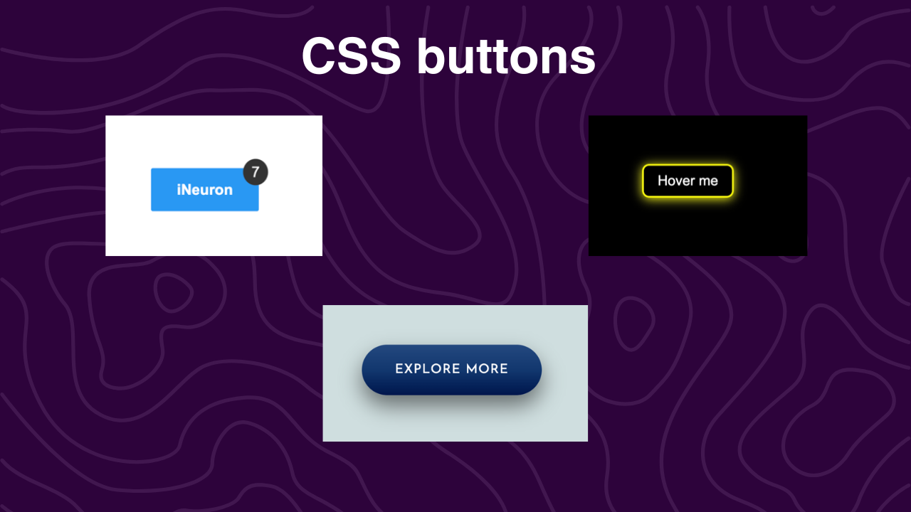
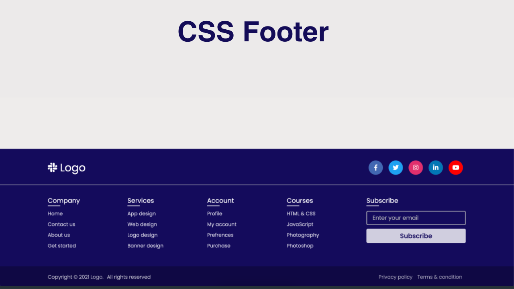

Hi , Iam Lakshmi

# CSS_challenges

in this practice I have learnt to style

- buttons
- forms
- navbars
- footers
- tables

> time taken to style 3 types of buttons : 30 mins

> time taken to finish 2 footers : 1.5 hours

## what have i learnt

- box_shadow
- positioning
- flexbox

---

>  
